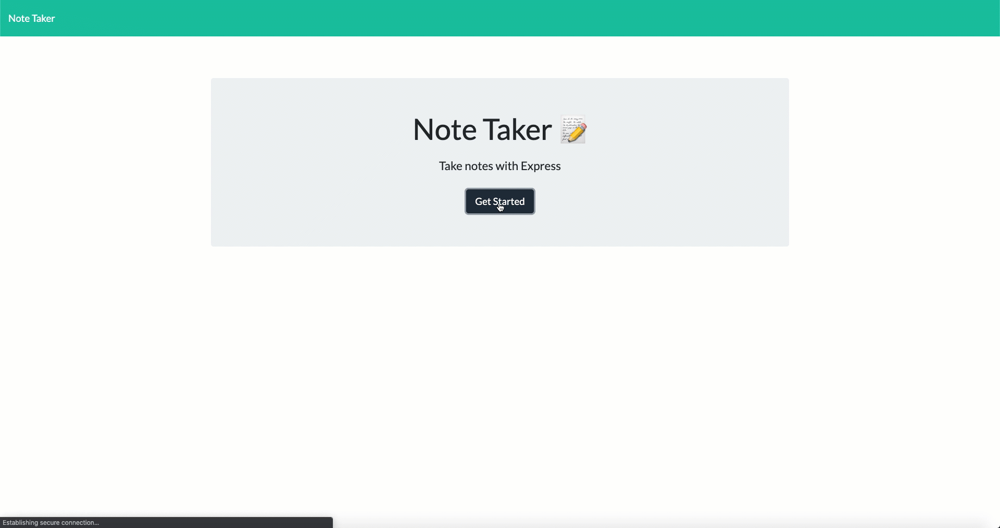

# Note Taker

## Description 
This app allows users to to create, read and delete notes.
## Instructions 
### Getting to the App
1. Navigate to: [My App](https://note-taker-al.herokuapp.com/)
### Starting the App
1. Click "Get Started"
### Entering and saving a note
1. Enter your note title where it says "Note title"
1. Enter in your note where it says "Note Text"
1. After filling out both sections, in the Top left corner click the save disk icon
### Viewing saved notes 
1. Note will post to left hand side bar
1. Select the note title
### Clear out all text fields or save note info
1. Click the pencil icon in the top right hand corner
### Delete save notes 
1. Select the trash icon for the note you wish to remove

## User Story

AS A user, I want to be able to write and save notes

I WANT to be able to delete notes I've written before

SO THAT I can organize my thoughts and keep track of tasks I need to complete

## Business Context

For users that need to keep track of a lot of information, it's easy to forget or be unable to recall something important. Being able to take persistent notes allows users to have written information available when needed.

## Acceptance Criteria

Application should allow users to create and save notes.

Application should allow users to view previously saved notes.

Application should allow users to delete previously saved notes.

### Demo
